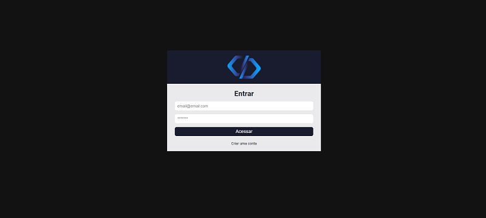
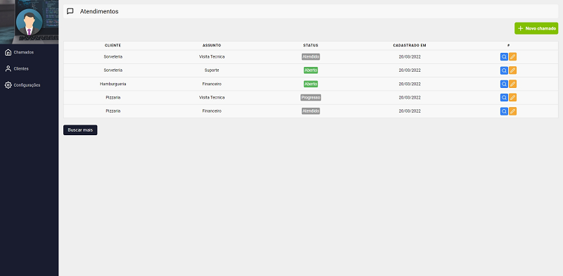
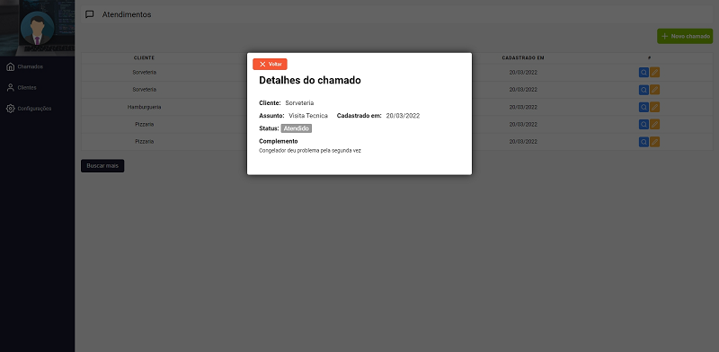
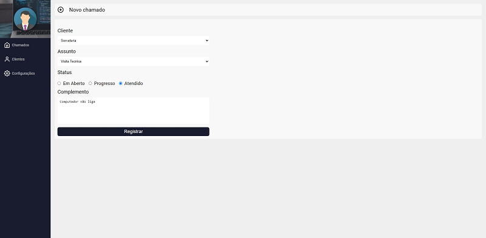
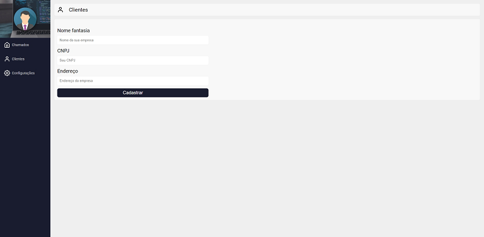
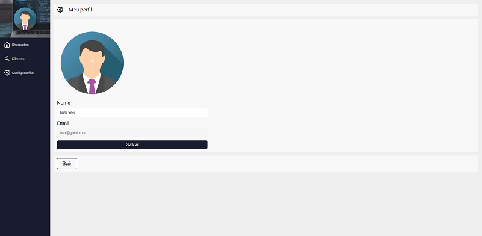

<h1 align="center">Sistema Chamados</h1>

Aplicação de gestão de chamados com login e persistência de dados integradas com a plataforma de desenvolvimento Firebase. 

<p align="center">	
		 
</p>

<p align="center">
	<a href="#computer-tecnologias">Tecnologias</a> •	
	<a href="#white_check_mark-features">Features</a> •
	<a href="#runner-começando">Começando</a> •
	<a href="#warning-pré-requisitos">Pré-requisitos</a> •	
	<a href="#hammer_and_wrench-instalação">Instalação</a> •
    <a href="#passport_control-login">Login</a> •	
	<a href="#construction_worker-autor">Autor</a> •
	<a href="#memo-licença">Licença</a>
</p>

<p align="center">
	<kbd>
		
	</kbd>
	<br/><br/>
	<kbd>
		
	</kbd>
	<br/><br/>
    <kbd>
		
	</kbd>
	<br/><br/>
    <kbd>
		
	</kbd>
	<br/><br/>
    <kbd>
		
	</kbd>
	<br/><br/>
    <kbd>
		
	</kbd>
	<br/><br/>    
</p>

## :computer: Tecnologias 

- [React](https://pt-br.reactjs.org/)
- [Firebase](https://firebase.google.com/)
- [React Router](https://reactrouter.com/)
- [Styled Components](https://styled-components.com/)

## :white_check_mark: Features

- [x] Criação de conta
- [x] Login autenticado no Firebase
- [x] Criar chamado
- [x] Editar chamado
- [x] Listar chamados
- [x] Visualizar detalhes de um chamado em janela modal
- [x] Requisição paginada de chamados
- [x] Cadastro de cliente
- [x] Configurações d eperfil com carregamento de imagem

## :runner: Começando 

Essas instruções fornecerão uma cópia do projeto instalado e funcionando em sua máquina local.

## :warning: Pré-requisitos 

O que você precisar para instalar a aplicação

```
Node >= 10.15.0
```

## :hammer_and_wrench: Instalação

Passos para rodar a aplicação

```
# Clonar
git clone https://github.com/tarcisioaraujo/sistema-chamados.git

# Acessar o diretório
cd sistema-chamados

# Instalar as dependências do Node JS (leva alguns minutos ☕)
npm install

# Rodar servidor React
npm start

# Acessar o endereço 
http://localhost:3000/
```

## :passport_control: Login 

Usuário de teste

```
E-mail: teste@gmail.com
Password: 123123
```

## :construction_worker: Autor

<a href="https://github.com/tarcisioaraujo">
 
 <br />
 <sub><b>Tarcísio Silva de Araújo</b></sub></a> <a href="https://github.com/tarcisioaraujo" title="GitHub"></a>

Feito por Tarcísio Silva de Araújo 👋

[](https://www.linkedin.com/in/tarcisiosaraujo/) 
[](mailto:tarcisio.saraujo@gmail.com)

## :memo: Licença

Este projeto esta sobe a licença [MIT](./LICENSE).